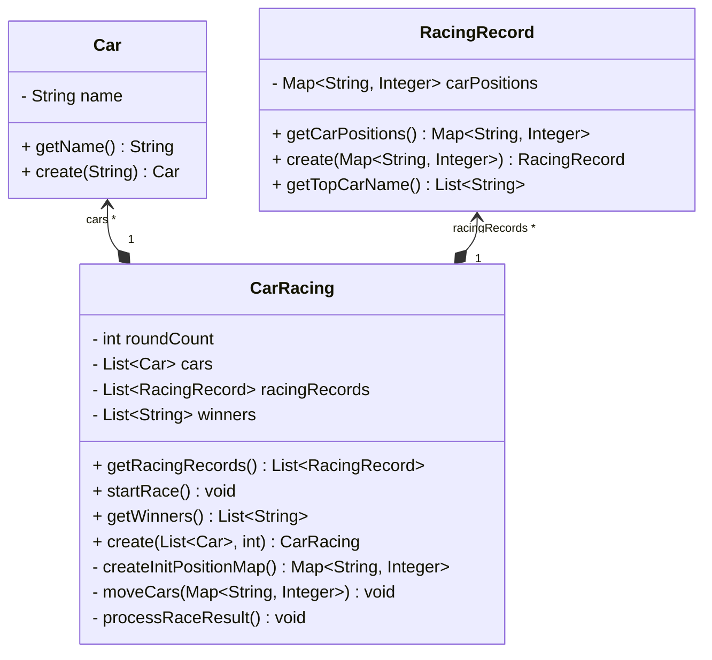
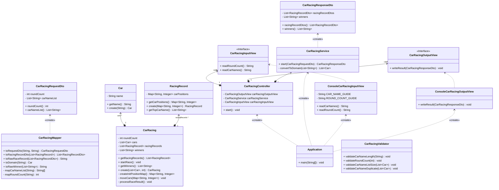

# **🚘자동자 경주**

## **✅ 기능 요구사항**

### **➡️ 입력**

1. 자동차를 n대 입력받는다.
   - 자동차의 이름은 쉼표를 기준으로 분리
   - 자동차의 이름은 5자 이하
2. 시도할 횟수를 입력받는다.
   - 문제에서 제시된 제한 횟수는 없음

[예시 입력]

```
경주할 자동차 이름을 입력하세요.(이름은 쉼표(,) 기준으로 구분)
pobi,woni,jun
시도할 횟수는 몇 회인가요?
5
```

### **⬅️ 출력**

1. 각 회차별로 각 자동차의 전진여부를 출력한다
   - 각 자동차의 이름과 함께 이동현황을 하이픈(-)으로 출력
2. 최종적으로 우승한 자동차의 이름을 출력한다.
   - 최종 우승자가 여려 명일 경우 쉼표(,)를 통해 구분

[예시 출력]

```
실행 결과
pobi : -
woni : 
jun : -

pobi : --
woni : -
jun : --

pobi : ---
woni : --
jun : ---

pobi : ----
woni : ---
jun : ----

pobi : -----
woni : ----
jun : -----

최종 우승자 : pobi, jun
```

### **🔁 세부 로직**

1. 자동차는 각 회차마다 전진 또는 정지할 수 있다.
   - 0~9사이 난수를 하나 뽑고 4이상인 경우에 전진한다.

### **⚠️ 예외 처리**

> 모든 예외는 `IllegalArgumentException`으로 처리한다.
>
- [x]  입력받은 자동차의 수가 2보다 작은 경우
- [x]  입력받은 자동차의 이름이 5글자 초과인 경우
- [x]  입력받은 자동차의 이름이 1글자 미만인 경우
- [x]  중복된 자동차 이름이 들어오는 경우
- [x]  입력받은 시도 횟수가 1보다 작은 경우
- [x]  입력받은 시도 횟수가 숫자가 아닌 경우

## ✅ 프로그램 구조

### **⭕️ 핵심 포인트**

- MVC 패턴 적용
   - 입력과 출력이 별도의 프론트엔드를 통해 이루어지는 것이 아니라 콘솔 즉, 자바 코드단으로 이루어지기 때문에 MVC 패턴을 적용하는 것이 좋다고 생각.
- 도메인 중심 설계
   - 핵심 도메인을 먼저 개발하고 그 안에 비즈니스 규칙 및 비즈니스 로직 구현
   - 도메인 중심으로 설계하면 객체지향적인 표현력이 올라가고 비즈니스 규칙 변경에 대응하기 쉬워짐
- DTO 및 매퍼 클래스 사용
   - 도메인을 보호하기 위해 DTO를 정의하고 DTO와 도메인간의 변환을 위해 매퍼클래스 사용

### 📖 핵심 도메인


| 클래스 | 설명 |
| --- | --- |
| `CarRacing` | 자동차 경주 |
| `Car` | 자동차 |
| `RacingRecord` | 경주 라운드별 기록 |


### 🏛️ 전체 클래스 구조



### 🗂️ 디렉토리 구조
```
└── 📂racingcar/
    ├── 📄 Application.java
    ├── 📂 controller/
    │   └── 📄 CarRacingController.java
    ├── 📂 domain/
    │   ├── 📄 Car.java
    │   ├── 📄 CarRacing.java
    │   └── 📄 RacingRecord.java
    ├── 📂 dto/
    │   ├── 📄 CarRacingRequestDto.java
    │   └── 📄 CarRacingResponseDto.java
    ├── 📂 mapper/
    │   └── 📄 CarRacingMapper.java
    ├── 📂 service/
    │   └── 📄 CarRacingService.java
    ├── 📂 util/
    │   └── 📄 CarRacingValidator.java
    └── 📂 view/
        ├── 📄 CarRacingInputView.java
        ├── 📄 CarRacingOutputView.java
        ├── 📄 ConsoleCarRacingInputView.java
        └── 📄 ConsoleCarRacingOutputView.java
```